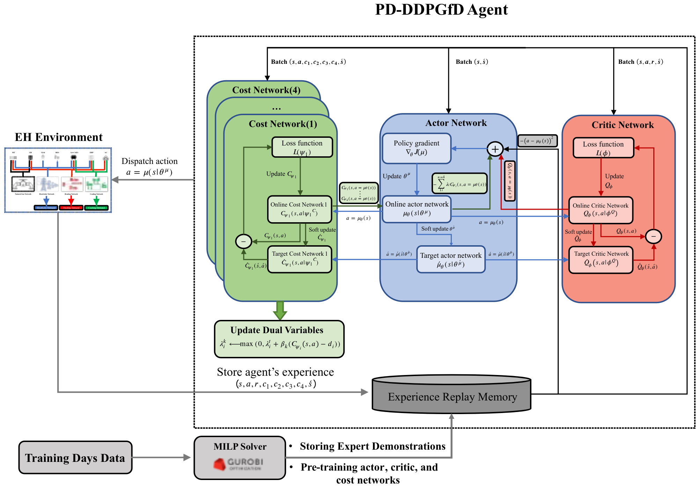

# Primal-Dual Deep Deterministic Policy Gradient From Demonstrations

Welcome to the PD-DDPGfD repository! This repository contains the code implementation for my thesis, which addresses the limitations of previous studies by proposing a safe deep reinforcement learning (DRL) algorithm. The algorithm is based on primal-dual optimization and imitation learning (IL) techniques, aiming to develop an adaptive controller for the optimal dispatch problem under uncertainty in Energy Hubs.

## Overview

The proposed algorithm takes into account the operational constraints of real-time scheduling in EH systems by utilizing cost networks. Unlike traditional DRL approaches that incorporate constraints as penalty terms in the reward function, this algorithm treats the constraints as independent cost functions. By doing so, it enhances the efficiency and effectiveness of the learning process.

To improve the learning process further and prevent the search agent from getting stuck in local optima, expert demonstrations are incorporated. These demonstrations, obtained from the optimal dispatch results derived from a MILP (Mixed Integer Linear Programming) solver, serve as a baseline solution for training days only.

Additionally, the algorithm considers the impact of off-design operation of the trigenerative AA-CAES (Advanced Adiabatic Compressed Air Energy Storage) on the scheduling of EH equipment, given the influence of partial-load operation on charging and discharging efficiencies.

## Evaluation

The performance of the proposed safe DRL algorithm is assessed based on the following metrics:

  1. Operational cost
  2. Constraint violation
  3. Utilization of the potential of AA-CAES

A comparison is made between the proposed algorithm and a base DRL algorithm (DDPG) as well as a benchmark, providing insights into the algorithm's effectiveness and superiority. The details of the proposed methodology can be found in the thesis file.

## Publication 
[Publication](https://www.sciencedirect.com/science/article/abs/pii/S2352152X22021363)

The methodology proposed in this thesis has been published as a journal paper in the *Journal of Energy Storage*. 

**Title**: Optimal dispatch of an energy hub with compressed air energy storage: A safe reinforcement learning approach

**Authors**: Alireza Daneshvar Garmroodi, Fuzhan Nasiri, Fariborz Haghighat

**Journal**: Journal of Energy Storage

**Volume**: 57

**Pages**: 106147

**Year**: 2023

**Publisher**: Elsevier

Citation:

```
@article{garmroodi2023optimal,
  title={Optimal dispatch of an energy hub with compressed air energy storage: A safe reinforcement learning approach},
  author={Garmroodi, Alireza Daneshvar and Nasiri, Fuzhan and Haghighat, Fariborz},
  journal={Journal of Energy Storage},
  volume={57},
  pages={106147},
  year={2023},
  publisher={Elsevier}
}
```

Please consider citing the paper if you use or reference the proposed methodology in your own research or work.
